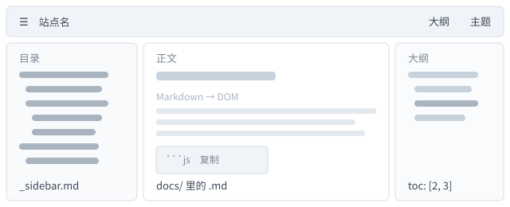

# 链接与图片

路径是这套站点里最容易踩坑的地方，但规则只有两条：**都相对当前文档所在目录**。
下面每条都能点，点一下就知道结果。

## 站内链接

- 上级目录：[快速开始](../快速开始.md) —— 点击后地址栏变成 `#/指南/快速开始`
- 再上一层：[指南总览](../README.md)
- 回到首页：[欢迎](../../README.md) —— 等价于 `#/`，左栏第一项就是它
- 带锚点：[支持的语法](支持的语法.md#表格) —— 直接定位到「表格」那一节
- 页内锚点：[跳到「图片」](#图片)
- 外链：[docsify 官网](https://docsify.js.org) —— 新窗口打开，不参与站内路由
- 中文文件名：[界面与移动端](../../参考/界面与移动端.md) —— 一样能跳（自动百分号编码）

> 不必手写 `#/`：照普通相对路径写就行，点击时自动转成路由；刷新、前进、后退都照常工作。

## 图片

- 图片按「内容根 + **本文所在目录**」解析，所以这张图就近放在隔壁的 `_assets/` 里；
- 相对路径与 `/` 开头的绝对路径都落在内容根下，外链图片（`https://…`）与 `data:` 用原地址；
- 点击图片会放大，再点一下、点背景或按 `ESC` 关闭。

## 目标里有空格或括号

链接目标（图片地址也一样）里出现空格、括号时要拿尖括号包起来，否则整条会退化成普通文本：

- 对：[维基百科：Function_(mathematics)](<https://en.wikipedia.org/wiki/Function_(mathematics)>) —— 括号被正确吃下；
- 错：`[维基百科](https://en.wikipedia.org/wiki/Function_(mathematics))` —— 只解析到第一个 `)`；
- 带 title 时引号不能省：`[文字](a.md "标题")` 可以，`[文字](a.md 标题)` 不行。

这类写法页面不会报错，只在控制台提醒一次，其它静默降级的情况见 [支持的语法](支持的语法.md)。

## 路径解析的两条规则

1. **链接**：`[文字](路径.md)` 相对当前文档目录解析，`../` 可以在内容根内上行；
2. **图片**：`` 同样相对当前文档目录，但它不会被当成路由——图片是直接请求的静态文件。

> 所以别把图片写成普通链接：指向非 `.md` 文件的链接会被当成路由解析，最后得到 404。

## 从别的目录引用本页

跨目录引用只需把 `../` 数对：本页在 `docs/指南/写内容/` 下，
引用 `docs/参考/` 里的文档要写 `../../参考/界面与移动端.md`，引用首页写 `../../README.md`。

越出内容根的路径（`../../..`、`#/../README.md`）一律 404，规则见 [URL 与路由](../../参考/URL与路由.md)。
